系统镜像解包与打包
==================

本项目最初使用的是型号为MIQI（SBC）的板卡，处理器为RK3288。考虑使用MIQI官网提供的lubuntu14.04社区版本的固件，而在项目中间需要增添以及需改驱动，以及文件系统，那么就需要将固件解包，然后修改内核，文件系统，然后再打包，如下则为该过程详解：

1.获得源码：
------------

::

    1.  $mkdir miqi_root
    2.  $cd miqi_root
    3.  $git clone https://github.com/mqmaker/miqi-linux-build.git build
    4.  $git checkout -b rklinux remotes/origin/miqi/v3.10
    5.  $git clone https://github.com/mqmaker/miqi-linux-kernel.git rockchip-kernel
    6.  $git checkout -b linux remotes/origin/miqi/linux

2.将官网下载的lubuntu解包：
---------------------------

::

    1. ./ rkImageMaker -unpack lubuntu镜像存放的位置 要存放到的位置
    （本项目是创建了一个与后面提到的内核源码处于同一级目录下的文件夹build）
    2. ./afptool -unpack build/firmware.img buid/unpack
    3.修改后打包
    修改即对内核或者是文件系统进行修改后，用新的内核或者是文件系统替换原来镜像中对应的内核或者是文件系统。

注意：package-file里面的linuxroot路径是错的，在linuxroot前面加上Image，即最后一行修改成如下样式。

::

    # NAME      Relative path
    #
    #HWDEF      HWDEF
    package-file    package-file
    bootloader  RKLoader.bin
    parameter   parameter
    # boot to linux
    recovery           Image\recovery.img
    #cache       Image\small_ext4.img
    #data       Image\small_ext4.img
    backup          RESERVED
    linuxroot   Image\linuxroot.img 

修改过后，使用以下脚本进行打包（注意前面变量设置，工具链存放位置，若不对的话可以修改脚本或者移动工具链）：

::

    #!/bin/bash
    SWD=$(cd "$(dirname "$0")"; pwd)
    AFPTOOL=${SWD}/../afptool
    IMGMAKER=${SWD}/../rkImageMaker
    #GEN_DIR=${SWD}/gen
    #OUT_DIR=${SWD}/out
    TMP_IMG=firmware.img
    UPDATE_IMG=ubuntu1404-sfs.img
    LOADER=RKLoader.bin

    pause()
    {
    echo "Press any key to quit:"
    read -n1 -s key
    exit 1
    }
    echo "start to make update.img..."
    # read pack-file packing to update.img
    #mkdir -p ${GEN_DIR}
    #mkdir -p ${OUT_DIR}
    echo ${SWD} $TMP_IMG
    $AFPTOOL -pack ${SWD} $TMP_IMG || pause
    # merge uboot and firmware
    rm -f ${UPDATE_IMG}
    $IMGMAKER -RK32 $LOADER $TMP_IMG ${UPDATE_IMG} -os_type:androidos || pause
    #rm -r ${GEN_DIR}
    echo "Making lubuntu1404.img OK."
    #echo "Press any key to quit:"
    #read -n1 -s key
    exit 0

注意：倒数第四行中echo "Making lubuntu1404.img OK."
lubuntu1404.img为你要修改后的镜像名。

系统镜像裁剪
============

1.获得ubuntu最小裸文件系统
--------------------------

（1）从ubuntu官方网站下载其提供的最小裸文件系统。
~~~~~~~~~~~~~~~~~~~~~~~~~~~~~~~~~~~~~~~~~~~~~~~~~

::

      mkdir~/ubuntu-rootfs
      cd ubuntu-rootfs

下载Ubuntu Core rootfs

::

    wget http://cdimage.ubuntu.com/ubuntu-core/releases/14.04.1/release/ubuntu-core-14.04-core-armhf.tar.gz

或者直接去网上找到对应的版本下载 ### （2）解压Ubuntu Core rootfs tar包

::

    sudo tar -xzvf ubuntu-core-14.04-core-armhf.tar.gz

（3）由于我们要chroot，所以需要能够在chroot环境执行armhf版本的binary，所以我们要接触linux的binfmt机制和qemu static解释器。
~~~~~~~~~~~~~~~~~~~~~~~~~~~~~~~~~~~~~~~~~~~~~~~~~~~~~~~~~~~~~~~~~~~~~~~~~~~~~~~~~~~~~~~~~~~~~~~~~~~~~~~~~~~~~~~~~~~~~~~~~~

::

    sudo apt-getinstall qemu-user-static
    sudo cp/usr/bin/qemu-arm-static ubuntu-rootfs /usr/bin/

（4）将本机的dns配置复制到目标rootfs，后面联网时会用到
~~~~~~~~~~~~~~~~~~~~~~~~~~~~~~~~~~~~~~~~~~~~~~~~~~~~~~

::

    sudo cp -b/etc/resolv.conf ~/ubuntu-rootfs/etc/resolv.conf

2.挂载文件系统
--------------

::

    sudo mount –t proc /proc ~/ubuntu-rootfs/proc
    sudo mount –t sysfs /sys ~/ubuntu-rootfs/sys
    sudo mount –o bind /dev ~/ubuntu-rootfs/dev
    sudo mount –o bind /dev/pts ~/ubuntu-rootfs/dev/pts

3.chroot(进入chroot环境)
------------------------

::

    sudo chroot ~/ubuntu-rootfs/

4.配置网络服务
--------------

使用vim或者是vi，修改/etc/apt/sources.list的内容。去掉除以deb-src开头的
所有库的注释。

::

      vim /etc/apt/sources.list
     或vi /etc/apt/sources.list

5.安装软件
----------

首先需要更新软件源

::

    sudo apt-get update

注意：如果失败，就需要配置dns，resolv.conf 建议安装软件如下：

::

    SSH，远程登陆系统需要用到。
    Networkmanager,网络管理的软件。
    wireless-tools。
    等等。

安装对应软件直接使用下方命令行：

::

    apt-get install 软件名

6.设置用户相关
--------------

adduser Ubuntu，然后根据提示设置密码。 设置主机名称：

::

    echo"ubuntu-arm">/etc/hostname

设置本机入口ip：

::

    echo"127.0.0.1 localhost">>/etc/hosts
    echo"127.0.1.1 ubuntu-arm">>/etc/hosts

允许自动更新dns：

::

    dpkg-reconfigureresolvconf

设置时区：

::

    dpkg-reconfiguretzdata

7.配置串口调试
--------------

添加一个/etc/init/ttyS2.conf文件（查得官方资料得知调试串口号为ttyS2）

::

    cp tty1.conf ttyS2.conf
    vi ttyS2.conf

修改其内容如下：

::

    start on stoppedrc or RUNLEVEL=[12345]
    stop on runlevel[!12345]
    respawn
    exec /sbin/getty-L 115200 ttyS2 vt102

8.退出chroot，直接exit
----------------------

9.卸载相关文件系统
------------------

::

    sudo unmount ~/ubuntu-rootfs/proc
    sudo unmount ~/ubuntu-rootfs/sys
    sudo unmount ~/ubuntu-rootfs/dev
    sudo unmount ~/ubuntu-rootfs/dev/pts

10.制作系统镜像
---------------

参考另一篇文档镜像打包与解包，先将原始镜像解包，将这个最小文件系统替换原始镜像
的文件系统，然后再打包，就做好了。

    注意：烧录系统后，提示文件系统空间不够，那么就重新resize2fs
    分区名。分区名可以用如下命令行：

::

    cat /proc/partition
    或 df

若出现无法上网的问题，可能需要手动获取IP地址，但如果安装了networkmanager，一般不会出现该问题
dhclient eth0

系统烧录
========

系统烧录在Windows，Ubuntu两个操作系统都可以实现，就之前提到的LUBUNTU社区版，在Windows下烧录较为容易，因此，此文叙述的为Windows下的烧录过程：

1. 下载 Release\_DriverAssistant.zip，解压，然后运行里面的 DriverInstall.exe 。
-------------------------------------------------------------------------------

为了所有设备都使用更新的驱动，请先选择"驱动卸载"，然后再选择"驱动安装"。

1.1 下载软件工具：
~~~~~~~~~~~~~~~~~~

AndroidTool\_Release\_v2.39，在MIQI官方文档里就会提供，或者直接从网上下载就行，这是Rockchip官方提供的烧录工具。
### 1.2 进入软件可以看到如下三界面：

.. figure:: Fag1.jpg
   :alt: Fag1

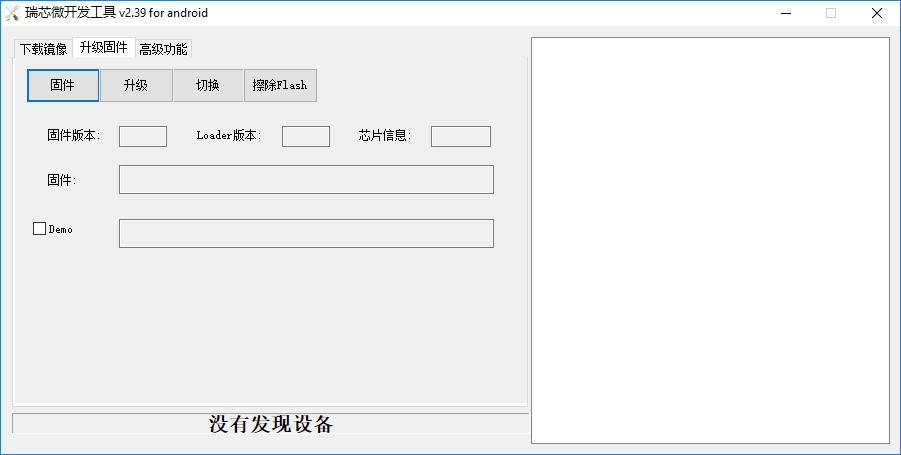

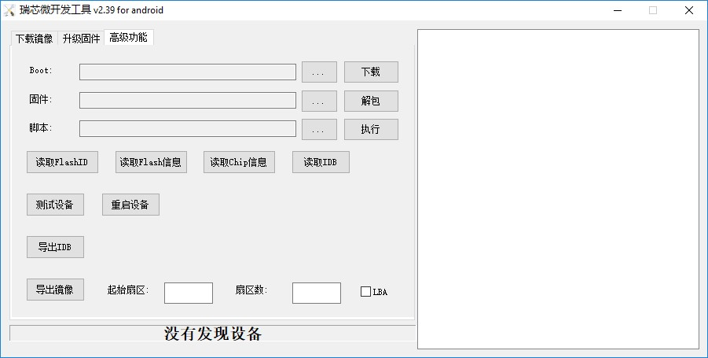

三种方法都可以实现烧录功能，但是本项目常用的是第二种，因为在做系统镜像时已经将其打包，故下面介绍该种方法：

1. 点击“固件”按钮
                 

选择对应你要烧录的镜像文件

2. 板卡：进入‘rockusb’模式
                          

（1） 断开USB电源

（2） 使用镊子或回形针按住恢复键

（3） 重新连接USB电源

（4） 等待大约3秒，然后释放恢复键。

（5） PC端上传软件应检测到加载设备

3. 执行“升级固件”步骤
                     

即按下“升级”按钮。在升级后，软件右端还会显示“检查固件”，最好等其执行完再断开。

串口调试
========

串口调试即是在PC上登陆板卡系统，然后对其进行调试。本项目大致使用到了两种登陆方式，第一种就是在自己PC上的UBUNTU操作系统上使用软件minicom进行登陆，还有一种就是通过SSH远程登入，第二种方法已经在其他文档中介绍了，本文不再赘述，下面介绍的是第一种登陆方法：

1. 硬件连接
-----------

使用转串口，将PC与开发板进行连接：
~~~~~~~~~~~~~~~~~~~~~~~~~~~~~~~~~~

（1） 转串口GND地线与开发板GND针相连；

（2） 转串口TXD输出线与开发板RX针相连；

（3） 转串口RXD输入线与开发板TX针相连；

2. 连接参数
-----------

（1） 波特率：115200

（2） 数据位：8

（3） 停止位：1

（4） 奇偶校验位：无

（5） 流控：无

这些参数是需要在minicom上面设置的，基本上只需要设置第一项参数就行，其他一般minicom上设置的都符合要求。

3. 串口调试
-----------

-  此项即是系统登陆的重要步骤，除了按照第二点提到的需要设置的参数以外，还需要将连接的串口号设置为ttyUSB0。
   设置minicom参数的命令行如下：

   sudo minicom –s

-  打开该界面后选择第三项，然后进行设置

-  注意设置完毕后需要保存，选择第五项，保存设置

-  设置完毕后，那么就将板卡上电，用之前提到的转串口的另一端的USB口连接上PC，打开minicom：

   ::

       sudo minicom

-  然后就可以进入到板卡的系统里了，注意初次登陆的密码为“miqi”，后面可以自行修改密码。

**需要注意的地方**\ ： ### 1.
若PC上没有显示板卡打印出来的信息，可以考虑重新上电 ### 2.
不再调试时，需要先退出minicom（ctrl A +
X），再停止对板卡的供电，若两步实施顺序改变，则下次使用minicom时会出现以下这种情况：
#### 串口被锁（Device /dev/ttyS0 is locked ##### **解决方法**\ ：

::

     ls /var/lock
     出现LCK..ttyS0  subsys这个文件
     kill 0

之后就可以重新进入minicom了。

系统内核修改
============

本项目对内核修改的操作大致分为两部分，一部分是基本操作，包括编译内核以及编译内核模块和第二部分是本项目的相关特殊操作，包括配置uart3以及增添5g驱动，下面介绍了各部分工作过程：
## 1.1编译内核 在内核源码下执行make
menuconfig之后，就可以看到对应的内核配置界面，用户可以勾选需要编译的驱动以及其他文件，对于驱动可以选择将其直接编译进内核，也可以选择将其编译成模块，如果选择编译成模块，可以参考如下\ **3.2编译成modules**\ 。
在用户配置完内核后，会生成一个配置文件，用该配置文件对内核进行编译，用如下脚本进行编译：

::

    #!/bin/bash

    ###################################################################
    ##
    ##  You need to change ANDROID_ROOT to real Android SDK path !!!!!
    ##
    ###################################################################

    MIQI_BUILD_DIR=${PWD}
    MIQI_KERNEL_DIR=${PWD}/../rockchip-kernel
    MIQI_ROOTFS_IMG_FULLPATH=

    ARCH=arm
    CROSS_COMPILE=arm-eabi-
    export ARCH CROSS_COMPILE
    export PATH=${MIQI_BUILD_DIR}/prebuilts/gcc/linux-x86/arm/arm-eabi-4.6/bin:$PATH

    build_kernel()
        {
    (
        cd $MIQI_KERNEL_DIR
        make ARCH=arm xxxx_defconfig
        make ARCH=arm -j8 rk3288-MiQi.img

        ./mkbootimg --kernel arch/arm/boot/zImage \
            --ramdisk ${MIQI_BUILD_DIR}/images/rootfs.cpio.gz  \
            --second resource.img \
            --output recovery-linux.img
        
    )

        }

    build_kernel

注意：

1. build\_kernel函数中对应的make ARCH=arm
   xxxx\_defconfig这一行中，xxxx\_defconfig即为上面提到的你自己配置内核后生成的配置文件，其具体名字需要在脚本中自行修改，该脚本会按照该文件对内核进行编译。

2. 脚本最前面的变量设置。本人是将内核源码以及build文件夹（即存放lubuntu解包后存放的位置，以及打包后新镜像存放的位置）。因此该脚本是放在build文件夹下。

1.2编译modules
--------------

在内核源码对应的文件目录下执行如下命令行：

若报错
“编译链位置错误”，则将build文件夹下的prebuild考过去到内核所在文件夹上一级对应makefile中的编译工具链的位置，该文件夹下包含编译内核需要的工具链。

::

    make modules
    mkdir modules_install
    make INSTALL_MOD_PATH=./modules_install modules_install

拷到开发版后，清楚模块安装目录(该目录含有链接，会影响SDK的编译)

1.3 配置uart3,即对应系统中ttys3串口，需要连接飞控使用。
-------------------------------------------------------

1.3.1配置 DTS 节点
~~~~~~~~~~~~~~~~~~

文件 kernel/arch/arm/boot/dts/rk3288.dtsi 中已经有 uart 相关节点定义，

如下所示：uart\_gps: serial@ff1b0000 { compatible = "rockchip,serial";
reg = <0xff1b0000 0x100>; interrupts = ; clock-frequency = <24000000>;
clocks = <&clk\_uart3>, <&clk\_gates6 11>; clock-names = "sclk\_uart",
"pclk\_uart"; current-speed = <115200>; reg-shift = <2>; reg-io-width =
<4>; dmas = <&pdma1 7>, <&pdma1 8>;#dma-cells = <2>; pinctrl-names =
"default"; pinctrl-0 = <&uart3\_xfer &uart3\_cts &uart3\_rts>; status =
"disabled"; };

注：uart\_gps 在该文件的 aliases 节点中被定义为：\ **serial3 =
&uart\_gps**;

用户只需在 **kernel/arch/arm/boot/dts/firefly-rk3288.dts
**\ 文件中打开所要使用的节点即可，

如下所示：&uart\_gps { status = "okay"; dma-names = "!tx",
"!rx";pinctrl-0 = <&uart3\_xfer &uart3\_cts>; };

1.4增添驱动（5G）
-----------------

无人机需要网络传输功能，而实验室环境中受到较多2.4GHZ
wifi信号的干扰，那么考虑采用5GHZ wifi
信号。在网上购买5G网卡后，发现需要8811AU驱动，而在内核源码对应的目录下，执行make
menuconfig,并未发现8811AU驱动，那么需要自己添加进去，过程如下（在此之前需要将该驱动文件下载下来）：

1、将8811AU.tar.gz（名字可以自行修改）文件解压至”内核源码包/drivers/net/wireless/”路径下。

2、make menuconfig，找到Device drivers->network device support->wireless
lan->usb zd1201 based wireless device support\*\*选为\*

3、修改”内核源码包/drivers/net/wireless”路径下的Kconfig，底行增加：
source "drivers/net/wireless/8811AU/Kconfig”

4、修改”内核源码包/drivers/net/wireless”路径下的makefile，底行增加：
obj-$(CONFIG\_8811AU) +=8811AU/

5、到内核源码包位置make menuconfig，选中Device drivers->network device
support->wireless lan->8811AU USB wifi选为\*

6、保存 make之后。
注意：修改完内核后需要重新编译内核，若是增添了内核模块，需要重新编译内核模块，放到系统指定位置下。

系统环境配置
============

此处环境配置指的是本项目所需要用到的各个软件环境以及所需要的库的配置，包括：
**Opencv，Ros，Optitrack，Eigen，mavros**\ 等。

Opencv
------

--------------

１.安装交叉编译工具链，安装过程如下：
~~~~~~~~~~~~~~~~~~~~~~~~~~~~~~~~~~~~~

例：安装版本为gcc-linaro-arm-linux-gnueabihf-4.8-2014.04\_linux
^^^^^^^^^^^^^^^^^^^^^^^^^^^^^^^^^^^^^^^^^^^^^^^^^^^^^^^^^^^^^^^

--------------

-  网上获取gcc-linaro-arm-linux-gnueabihf-4.8-2014.04\_linux.tar，在所在目录进行解压，使用命令行

   ::

       sudo tar -xvf gcc-linaro-arm-linux-gnueabihf-4.8-2014.04_linux.tar

-  在/usr/local下新建一个文件夹，使用命令行

   ::

       sudo mkdir arm-toolchain

-  将刚才解压后得到的gcc-linaro-arm-linux-gnueabihf-4.8-2014.04\_linux文件复制到arm-toolchain里，使用命令行

   ::

       sudo cp -r /home/wl/下载/gcc-linaro-arm-linux-gnueabihf-4.8-2014.04_linux /usr/local/arm-toolchain

-  完成之后，需要设置环境变量，使用命令行打开/etc/profile 或
   /etc/bash.bashrc sudo gedit /etc/profile 在文件的末尾加入下面这一行：

   ::

       Export PATH=$PATH:/usr/local/arm-toolchain/gcc-linaro-arm-linux-gnueabihf-4.8-2014.04_linux/bin

-  保存过后使用如下命令行使其立即生效：

   ::

       source /etc/profile

-  最后通过如下方式验证是否安装成功：arm-linux-gnueabi-gcc
   –v，出现版本信息说明验证安装成功

2.安装Cmake，安装过程如下：
~~~~~~~~~~~~~~~~~~~~~~~~~~~

使用如下命令行：

::

    sudo apt-get install cmake  即完成安装。

3.Opencv的编译：
~~~~~~~~~~~~~~~~

(1)打开Cmake：
^^^^^^^^^^^^^^

-  sudo
   cmake-gui,选择要编译的源文件和编译之后存放的路径,本人选择的路径分别为：/home/wl/下载/opencv-3.2.0，/home/wl/arm-linux-opencv-binaries，arm-linux-opencv-binaries为新建的文件夹。
   #### (2)然后配置编译工具。

-  Specify the generator for this project:第一项选择Unix
   Makefile,勾选第四项Specify options for cross-compiling。

-  Sext后，Target
   System为linux,Compilers选项下的C和C++分别对应安装的gcc-linaro-arm-linux-gnueabihf-4.8-2014.04\_linux路径下的arm-linux-gnueabihf-gcc和arm-linux-gnueabihf-g++(在bin目录中)
   ,Target
   Root选项为gcc-linaro-arm-linux-gnueabihf-4.8-2014.04\_linux的安装目录，不用带/bin.
   #### (3)Config:

-  点击finish之后会出现第一次Configure的结果，可能出现各种错误，比如说\ *ERROR
   in configuration process,project files may be invalid*
   这个错误可以无视掉，直接点击OK 。
-  然后就是修改红色区域的部分值，去掉某些值：
   WITH\_OPENCL、WITH\_TIFF　BUILD\_OPENEXR、WITH\_OPENEXR、WITH\_CUDA
   并修改CMAKE\_INSTALL\_PREFIX的值为自己想要的路径，这里我设置为了/usr/local/arm-opencv/。

-  然后打开/home/wl/arm-linux-opencv-binaries目录下的CMakeCache.txt文件修改里边的两个值：
   CMAKE\_EXE\_LINKER\_FLAGS原来为空，加上-lpthread -lrt -ldl
   CMAKE\_INSTALL\_PREFIX:PATH= XXXXXX(安装路径) 见上。
   然后就可以执行sudo
   make,注意这里要在编译生成文件目录下操作，这里我的路径为/home/wl/arm-linux-opencv-binaries

**编译过程中可能出现如下问题**\ ：
^^^^^^^^^^^^^^^^^^^^^^^^^^^^^^^^^^

-  gnueabihf/bin/ld:　../../3rdparty/lib/libzlib.a(crc32.obj):　relocation　R\_ARM\_THM\_MOVW\_ABS\_NC　against　\`a　local　symbol'can　ot　be　used　whenmaking　a　shared　object;　recompile　with　-fPIC

-  注意到其中的libzlib.a文件，我们需要在你指定的二进制文件输出路径的：3rdparty/zlib/CMakeFiles/zlib.dir/flags.make文件中，将C\_FLAGS　=　　-fsigned-char　-W　-Wall　-Werror替换为
   C\_FLAGS = -fsigned-char -O3 -fPIC -W -Wall -Werror
   就行了，在这之后或者之前都可能出现同样情况的错误，可能出错的不是这个文件，但是是同类型文件，你只需要找到对应文件按照上面修改就行了。

-  后面需要重新到config步骤，修改CMakeCache.txt文件修改里边的两个值，具体如上，一直到不会出现该错误即可，最后make完成。

(5)最后执行　
^^^^^^^^^^^^^

::

    sudo make install。

4.配置编译环境：
~~~~~~~~~~~~~~~~

在此先做说明：

-  编译文件存放目录：/home/wl/arm-linux-opencv-binaries

-  编译生成的头文件存放目录：（即CMAKE\_INSTALL\_PREFIX的值）/usr/local/arm-opencv

-  进行编辑库连接配置文件，

   cd /etc/ld.so.conf.d sudo gedit opencv.conf 添加如下内容：

   ::

       /usr/local/arm-opencv/lib

-  然后 ldconfig使生效 添加环境变量

   ::

       sudo gedit /etc/bash.bashrc   

   在最后添加

   ::

       PKG_CONFIG_PATH=$PKG_CONFIG_PATH:/usr/local/opencv-arm/lib/pkgconfig
       export PKG_CONFIG_PATH

-  
-  编译测试：假如你已经有一个main.cpp函数文件了，进入其 所在的文件夹
   执行下面的命令进行编译：

   ::

       arm-linux-gnueabihf-g++ main.cpp -o hh  -lpthread -lrt `pkg-config --libs --cflags opencv`　　

    其中arm-linux-gnueabihf-g++是编译用的编译器；
    main.cpp为要进行编译的程序；hh为编译之后生成的可执行二进制程序，可以任意命名，过程中可能报错找不到opencv.pc，那么我们将二进制文件中的unix-install中的openv.pc文件复制到/usr/lib/pkgconfig中即可。

-编译成功之后，就会发现生成了一个名为hh的二进制文件，至此，在电脑上的OpenCV交叉编译已全部完成！剩下的工作就是把编译好的OpenCV库拷到ARM平台中。
### 5.移植到arm平台上

-把arm-opencv拷贝到ARM中的/usr/local文件夹下,把arm-linux-opencv-binaries拷贝到ARM中的/home/wl文件夹下。之后验证的方法和上一步一样。

最后整个Opencv的移植就完成了！！！

ROS
---

1. 首先用minicom连接开发板，没有问题。
~~~~~~~~~~~~~~~~~~~~~~~~~~~~~~~~~~~~~~

使用的命令行：

::

    sudo minicom

2. 接着在开发板上输入命令行添加软件源到sources.list
~~~~~~~~~~~~~~~~~~~~~~~~~~~~~~~~~~~~~~~~~~~~~~~~~~~

使用的命令行：

::

    $sudo sh -c 'echo "deb http://packages.ros.org/ros/ubuntu trusty main" > /etc/apt/sources.list.d/ros-latest.list'

3. 然后设置密钥
~~~~~~~~~~~~~~~

使用的命令行:

::

    $ wget http://packages.ros.org/ros.key -O - | sudo apt-key add –

4. 接下来输入
~~~~~~~~~~~~~

::

    $ sudo apt-get update

5. 然后输入
~~~~~~~~~~~

::

     $ sudo apt-get install ros-indigo-base安装ros

6. 接下来初始化ros：依次输入
~~~~~~~~~~~~~~~~~~~~~~~~~~~~

::

     $ sudo rosdep init
     $ rosdep update

7. 最后配置环境：
~~~~~~~~~~~~~~~~~

输入：

::

    $ echo "source /opt/ros/indigo/setup.bash" >> ~/.bashrc

使环境变量设置立即生效输入：

::

    $ source ~/.bashrc

可能遇到的问题
''''''''''''''

 1. 命令行长度的问题：在添加软件源和设置密钥输入命令行时，由于minicom的bug会让命令行输入到一定长度时转而从气势位置输入让前面的代码消失，但这个不影响代码的效果，与后面的bug也没有关系。
^^^^^^^^^^^^^^^^^^^^^^^^^^^^^^^^^^^^^^^^^^^^^^^^^^^^^^^^^^^^^^^^^^^^^^^^^^^^^^^^^^^^^^^^^^^^^^^^^^^^^^^^^^^^^^^^^^^^^^^^^^^^^^^^^^^^^^^^^^^^^^^^^^^^^^^^^^^^^^^^^^^^^^^^^^^^^^^^^^^^^^^

 2. Update时会出现一些网站hit不了，只需要多试几次至成功即可。
^^^^^^^^^^^^^^^^^^^^^^^^^^^^^^^^^^^^^^^^^^^^^^^^^^^^^^^^^^^^^

 3. Install时如果安装有full版本可能会无法locate，所以不要安装full版本，用base版本即可。
^^^^^^^^^^^^^^^^^^^^^^^^^^^^^^^^^^^^^^^^^^^^^^^^^^^^^^^^^^^^^^^^^^^^^^^^^^^^^^^^^^^^^^^

 4. Install时要注意ros支持的ubuntu版本，如indigo时14.04，而16.04则需要别的版本。
^^^^^^^^^^^^^^^^^^^^^^^^^^^^^^^^^^^^^^^^^^^^^^^^^^^^^^^^^^^^^^^^^^^^^^^^^^^^^^^^

 5. Install时可能会有一些目标get不到，在install一次即可。
^^^^^^^^^^^^^^^^^^^^^^^^^^^^^^^^^^^^^^^^^^^^^^^^^^^^^^^^^

 6. 如果初始化失败可能时前面的install没有成功，回头看一下再install直至成功。
^^^^^^^^^^^^^^^^^^^^^^^^^^^^^^^^^^^^^^^^^^^^^^^^^^^^^^^^^^^^^^^^^^^^^^^^^^^^

Optitrack
=========

--------------

从github上下载压缩包：

1. 进入板卡，在/home目录下创建一个名为catkin\_make的文件夹：
------------------------------------------------------------

cd /home mkdir catkin\_make

再在该文件夹下创建一个名为/src的文件夹： cd ./catkin\_make mkdir src

2. 将压缩包解压后的源文件放到刚刚创建的文件夹/src下:
----------------------------------------------------

cp -r 解压后文件所在位置 /home/src ## 3.
在catkin\_make文件夹底下对源码进行编译： cd .. catkin\_make
至此，该库已编译完成！

Eigen，mavros
=============

--------------

1. 从网上下载源码，然后解压
---------------------------

2. 在解压的目录，对其进行编译
-----------------------------

::

    make
    make install

交叉编译器
==========

1. 交叉编译器简介
-----------------

在一种计算机环境中运行的编译程序，能编译出在另外一种环境下运行的代码，这个编译过程就叫交叉编译.简单地说，就是在一个平台上生成另一个平台上的可执行代码.

2. 体系结构与操作系统
---------------------

2.1使用的体系结构有:ARM结构、x86结构等
~~~~~~~~~~~~~~~~~~~~~~~~~~~~~~~~~~~~~~

2.2使用的操作系统有linux等.
~~~~~~~~~~~~~~~~~~~~~~~~~~~

3. 安装交叉工具链
-----------------

3.1自选版本下载
~~~~~~~~~~~~~~~

3.1.1工具下载:
^^^^^^^^^^^^^^

从linaro的网站下载预编译包 ，以
gcc-linaro-arm-linux-gnueabihf-4.8-2014.04\_linux 为例

::

        解压 gcc-linaro-arm-linux-gnueabihf-4.8-2014.04_linux.tar. xz

3.1.2解压方法：
^^^^^^^^^^^^^^^

解压tar.xz文件：先 xz -d xxx.tar.xz 将 xxx.tar.xz解压成 xxx.tar,然后再用
tar xvf xxx.tar来解包

另外解压方式：

::

        tar –xvf file.tar //解压 tar包
        
        tar -xzvf file.tar.gz //解压tar.gz
        
        tar -xjvf file.tar.bz2   //解压 tar.bz2

易错点：
^^^^^^^^

::

        apt-get install g++-arm-linux-gnueabihf 

获取的是最新版本的编译工具而交叉编译工具版本号一定要和你选用的arm平台的版本对应，可以先确定arm平台编译工具的版本再下载对应版本到本机，不然会使得本机交叉编译的文件无法在arm平台运行。

3.1.3环境变量设置（设置环境变量使得编译器指向你所下载的工具链）
^^^^^^^^^^^^^^^^^^^^^^^^^^^^^^^^^^^^^^^^^^^^^^^^^^^^^^^^^^^^^^^

::

        ~$ sudo gedit .bashrc

打开文件后，在最后俩行加上编译工具链的路径：

::

    PATH=$PATH:/home /下载/gcc-linaro-arm-linux-gnueabihf-4.8-2013.10_linux/bin 
    export PATH

具体格式依据： PATH=$PATH:/（你所解压之后 的工具链所在的路径）/bin
export PATH

易错点：
^^^^^^^^

第一行的\ :math:`PATH后面是英文冒号，`\ PATH之前的等号左右俩侧不要存在空格，不然报错

3.1.4使环境变量 生效
^^^^^^^^^^^^^^^^^^^^

::

    ~$ source .bashrc

3.1.5 测试
^^^^^^^^^^

::

    ~$ arm-linux-gnueabihf-gcc -v

报错：
^^^^^^

::

    arm-linux-gnueabihf-gcc: error while loading shared libraries: libstdc++.so.6: cannot open shared object file: No such file or directory

原因：64位的系统，缺少 lib32stdc++6这个包
^^^^^^^^^^^^^^^^^^^^^^^^^^^^^^^^^^^^^^^^^

解决：~$ sudo apt-get install lib32stdc++6
^^^^^^^^^^^^^^^^^^^^^^^^^^^^^^^^^^^^^^^^^^

再测试　~$ arm-linux-gnueabihf-gcc -v 出现相应版本号

3.2默认版本下载
~~~~~~~~~~~~~~~

采用指令默认下载相应工具链

::

    sudo apt-get install gcc-arm-linux-gnueabihf g++-arm-linux-gnueabihf

4. 交叉编译Compute Library examples
-----------------------------------

4.1官网下载并且编译Computer library文件
~~~~~~~~~~~~~~~~~~~~~~~~~~~~~~~~~~~~~~~

4.1.1安装git工具：
^^^^^^^^^^^^^^^^^^

::

    sudo apt-get install git

4.1.2下载Computer library文件：
^^^^^^^^^^^^^^^^^^^^^^^^^^^^^^^

::

    git clone https://github.com/Arm-software/ComputeLibrary.git

4.1.3安装scons工具：
^^^^^^^^^^^^^^^^^^^^

::

    $sudo apt-get install scons

4.1.4在该路径下打开终端，用scons命令对Computer library进行编译：
^^^^^^^^^^^^^^^^^^^^^^^^^^^^^^^^^^^^^^^^^^^^^^^^^^^^^^^^^^^^^^^^

    （https://arm-software.github.io/ComputeLibrary/v17.04/index.xhtml#S3\_2\_2\_examples）

::

    指令：$scons Werror=1 -j8 debug=0 asserts=1 neon=0 opencl=1 embed_kernels=1 os=linux arch=armv7a

参数注释：
^^^^^^^^^^

启用\_debug = 1\_，并且使用符号构建库同时不启用优化 使用\_debug =
0\_和\_asserts=1\_：启用优化并删除符号

如果自己下载的工具链与官网的工具链相同\_Werror=1\_,
如果使用不同的编译器版本\_Werror=0\_

架构：x86目标只能与\_neon = 0\_和\_opencl = 1\_一起使用
arch是你使用的arm平台

4.2单独编译cl\_convolution和neon\_convolution俩个examples
~~~~~~~~~~~~~~~~~~~~~~~~~~~~~~~~~~~~~~~~~~~~~~~~~~~~~~~~~

下载官网上库已经编译好的arm\_compute-v17.03.1-bin（以17.03.1为例）文件

在该路径下打开终端编译: #### 4.2.1cl\_convolution
~$arm-linux-gnueabihf-g++ examples/cl\_convolution.cpp
test\_helpers/Utils.cpp -I. -Iinclude -std=c++11 -mfpu=neon -L.
-larm\_compute -lOpenCL -o cl\_convolution #### 4.2.2neon\_convolution
arm-linux-gnueabihf-g++ examples/cl\_convolution.cpp
test\_helpers/Utils.cpp -I. -Iinclude -std=c++11 -mfpu=neon
-L/home/dengkai/下载/arm\_compute-v17.03.1-bin/lib/linux-armv7a-neon-cl
-larm\_compute -L/home/dengkai/下载/arm\_compute-v17.03.1-bin/-lOpenCL
-o cl\_convolution

报错:arm\_compute not found opencl not found

原因：armcomputer和opencl俩个库路径不对

解决：找到这俩个库的位置，具体参照以下代码

::

     arm-linux-gnueabihf-g++ examples/neon_convolution.cpp test_helpers/Utils.cpp -I. -Iinclude -std=c++11 -mfpu=neon -L/home/dengkai/下载/arm_compute-v17.03.1-bin/lib/linux-armv7a-neon -larm_compute -L/home/dengkai/下载/arm_compute-v17.03.1-bin/-lOpenCL -o neon_convolution

也可以在arm\_compute-v17.03.1-bin目录下获得编译好的neon\_convolution文件

::

    gcc examples/neon_convolution.cpp utils/Utils.cpp -I. -Iinclude -std=c++11 -mfpu=neon -larm_compute -larm_compute_core -o neon_convolution

注意： linux-armv7a-neon-cl和 linux-armv7a-neon略有不同记得修改

5. 传输至板卡运行
-----------------

5.1电脑pc终端与板卡（rk3288）minicom连接
~~~~~~~~~~~~~~~~~~~~~~~~~~~~~~~~~~~~~~~~

::

    ~$sudo minicom  之后输入本机密码修改
    ~$minicom -s

5.1.1Serial port setup选项配置
^^^^^^^^^^^^^^^^^^^^^^^^^^^^^^

选择配置项，这里我们主要配置Serial port setup选项，下面是基本配置

::

    ≠ A -    Serial Device      : /dev/ttyS
    ≠ B - Lockfile Location     : /var/lock
    ≠ C -   Callin Program      :
    ≠ D -  Callout Program      :
    ≠ E -    Bps/Par/Bits       : 115200 8N1
    ≠ F - Hardware Flow Control : No
    ≠ G - Software Flow Control : No
    ≠    Change which setting?
    +-----------------------------------------------------------------------+

A选项Serial Device
根据我们的串口来，如果是COM1我们就选择ttyS0（不过后面说的出错也有例外），COM2口选择ttyS1等等

F选项一定要改为NO，不然终端只能打印从下位机发过来的信息，而不能接受键盘的输入

5.1.2使用minicom
^^^^^^^^^^^^^^^^

报错及可能出现的问题：
^^^^^^^^^^^^^^^^^^^^^^

串口被锁（Device /dev/ttyS0 is locked） 解决：

::

    ~$ ls /var/lock
    LCK..ttyS0  subsys
    :~$ kill 0
    ~$ ls /var/lock
    subsys
    ~$ sudo minicom
    Welcome to minicom 2.3

5.2电脑pc终端与arm平台ssh连接
~~~~~~~~~~~~~~~~~~~~~~~~~~~~~

5.2.1板卡应该与pc在同一个局域网，检查是否联通，可以用ping指令
^^^^^^^^^^^^^^^^^^^^^^^^^^^^^^^^^^^^^^^^^^^^^^^^^^^^^^^^^^^^^

::

    ~$ ssh root@IP

例如

::

    ~$ ssh root@192.168.1.153

5.2.2报错：
^^^^^^^^^^^

::

    ssh: connect to host 192.168.1.153 port 22: No route to host

原因：ip地址不对

解决：

a.打开minicom端，输入

::

    ~$ ifconfig

获得ip地址（务必在进入minicom中输入该命令，在电脑pc下输入该命令获得的ip不对）

b.在电脑终端输入 ~$ ssh root@IP
之后提示输入密码，此处密码为板卡默认密码，官网上有写（我们平台是mqmaker）

5.2.3修改密码:进入minicom(sudo minicom)
^^^^^^^^^^^^^^^^^^^^^^^^^^^^^^^^^^^^^^^

输入以下指令：

::

    root@mqmaker:~# passwd root 
    Enter new UNIX password:  
    Retype new UNIX password:  
    passwd: password updated successfully

5.3 ssh链接平台以后传输文件
~~~~~~~~~~~~~~~~~~~~~~~~~~~

::

    scp /home/dengkai/lingd/upload/cl_convolution.o  root@192.168.1.153:/home/dk
    scp /home/dengkai/lingd/upload/neon_convolution.o  root@192.168.1.153:/home/dk

6. 板卡执行交叉编译完的文件
---------------------------

6.1运行可执行文件
~~~~~~~~~~~~~~~~~

::

    ~#./cl_convolution

6.1.1报错：
^^^^^^^^^^^

::

    ~#./cl_convolution
    terminate called after throwing an instance of 'cl::Error'
    what():  empty
    libarm_compute.so not found

解决：

::

    scp -r /home/下载/arm_compute-v17.03.1-bin/lib root@192.168.1.153:/usr/local/lib

将需要用到的库放至arm对应文件夹下

::

    cl_convolution: ELF 32-bit LSB  executable, ARM, EABI5 version 1 (SYSV), dynamically linked (uses shared libs), for GNU/Linux 3.2.0, BuildID[sha1]=e2d66d68a52b4d09a0a934980b934c3a79f0b8c7, not stripped
    ./cl_convolution: /usr/lib/arm-linux-gnueabihf/libstdc++.so.6: version `GLIBCXX_3.4.20' not found ( required by ./cl_convolution)

6.2运行结果
~~~~~~~~~~~

例子运行正确则返回

::

    "Test passed"

7. 本地编译
-----------

7.1配置工具git、g++、scons：
~~~~~~~~~~~~~~~~~~~~~~~~~~~~

::

    sudo apt-get install g++ git scons 

7.2下载ComputeLibrary
~~~~~~~~~~~~~~~~~~~~~

::

    git clone https://github.com/Arm-software/ComputeLibrary.git 

7.3本地编译：
~~~~~~~~~~~~~

::

    cd ComputeLibrary 
    scons Werror=1 debug=0 asserts=0 neon=1 opencl=0 examples=1 build=native -j`

motive配置
==========

1.标定相关文档
--------------

1.1保存工程
~~~~~~~~~~~

打开Motive软件，窗口显示如下界面

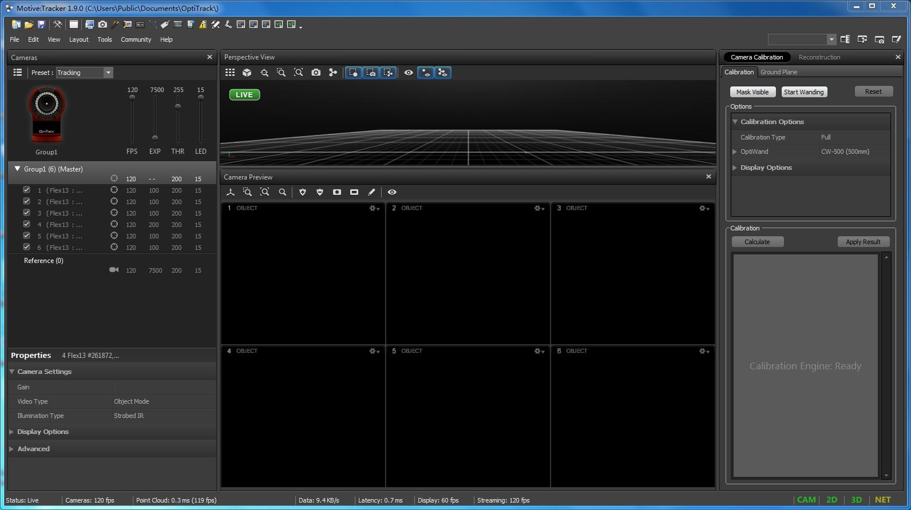

选择右上方区域Calibration目录下的Mask
Visible，出现保存对话框，选择Yes保存到相应位置。

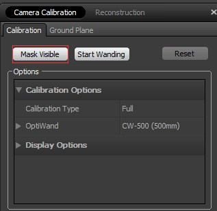

1.2确定摄像头位置
~~~~~~~~~~~~~~~~~

点击Calibration下第二个选项Start
Wanding，界面变为如下形式，等待采样标志点。

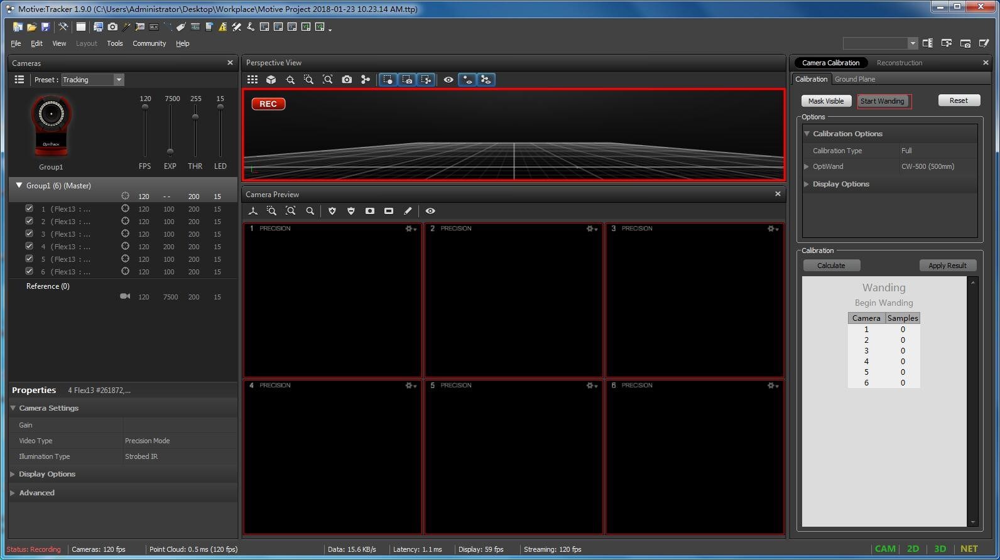

将带三个小球的长杆拿进工作区，进行各种无规则运动，以取得尽可能多的采样点，直至右下角区域背景由白色变为浅绿色（如下图所示），点击Calculate进行计算。

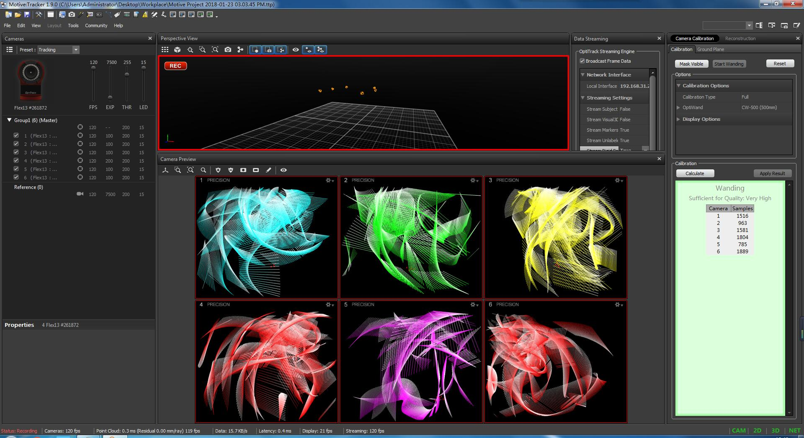

1.3确定坐标系
~~~~~~~~~~~~~

上述步骤能够得到六个摄像头之间的相对位置，但其坐标系仍与实际空间不符。
此后，将三角水平标定物放入网中，根据所需坐标系进行放置。放置好后，点击右上角区域Ground
Plane下的Set Ground Plane，完成标定。

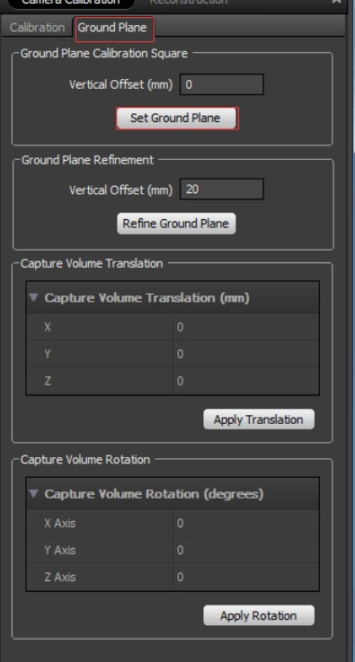

1.4建立刚体
~~~~~~~~~~~

将飞机放入工作区域。选中摄像头拍摄到飞机上的所有标定点，右键选择Rigid
Body下的Create From Selected Markers，建立刚体。

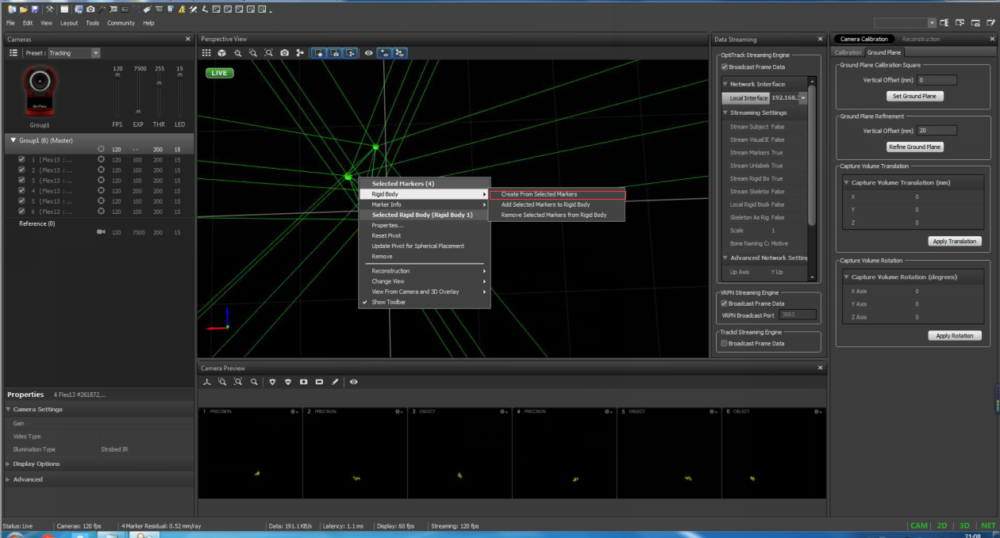

1.5设置Motive
~~~~~~~~~~~~~

选择View下的Rigid Body Properties

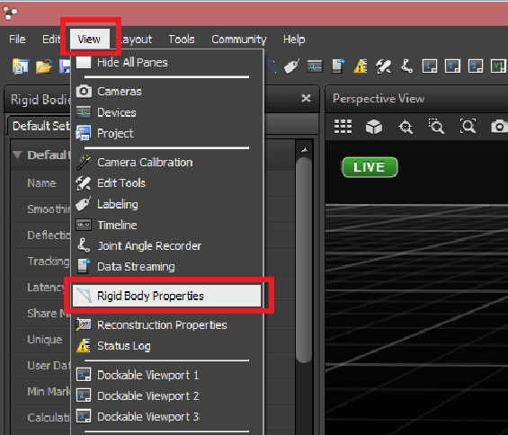

然后再选择View下的Data Streaming

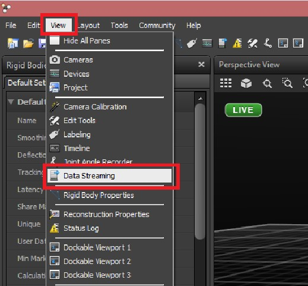

在Data Streaming中选择Local Interface下拉选项中的本地接口

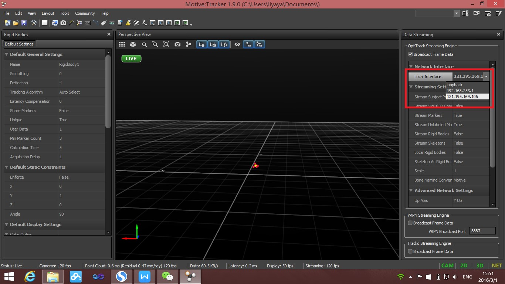

再将Stream Rigid Bodies设置成True

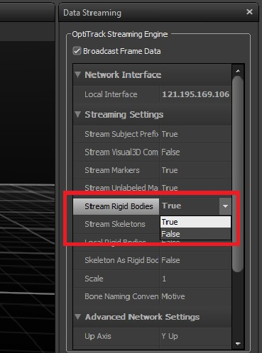

最后将Multicast Interface改成224.0.0.1

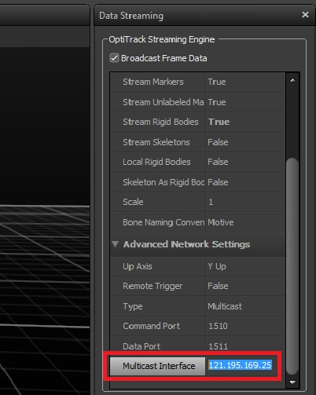

2.配置
------

(1)在第一个命令行窗口输入以下命令行：

::

    ssh root@192.168.31.34

 输入密码（如mqmaker):

::

    mqmaker

 输入以下命令：

::

    roslaunch mavros px4.launch

(2)打开一个新命令行窗口，输入以下命令行：

::

    ssh root@192.168.31.34

 输入密码（如mqmaker):

::

    mqmaker

 输入以下命令行： ``ls`` ``cd /home/`` ``cd /home/catkin make/``
``source devel/setup.bash`` ``roslaunch mocap optitrack mocap launch``

(3)显示图形窗口 ``rviz rviz``

(4)查看参数（如LPE\_PN\_V) ``rosrun mavros mavparam get LPE_PN_V``

(5)修改参数（如LPE\_PN\_V)
``rosrun mavros mavparam set LPE_PN_V number``

license
=======

`License BY CC
4.0 <https://creativecommons.org/licenses/by/4.0/deed.zh>`__
